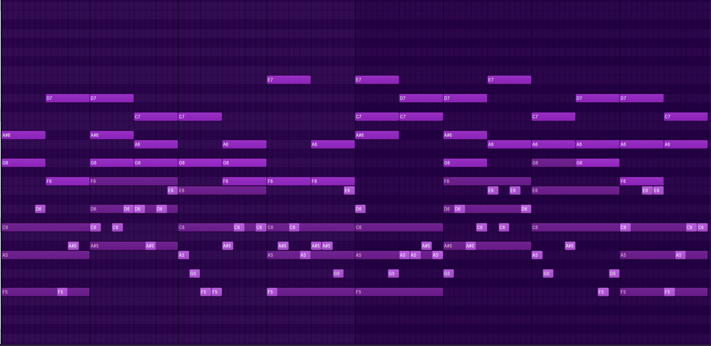
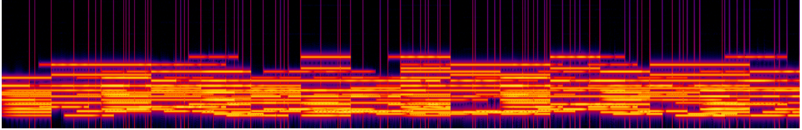

# Szczegółowy Techniczny Deep Dive


## 1. Parametryzacja muzyki - Gdzie definiujemy wszystkie elementy utworu

### 1.1 Klasa MusicParameters - Centralne miejsce kontroli

```python
@dataclass
class MusicParameters:
    """Parametry muzyczne zgodnie z dokumentacją AIR 4.0"""
    genre: str = "ambient"          # jazz, rock, techno, ambient
    mood: str = "peaceful"          # radosny, melancholijny, energetyczny, spokojny
    tempo: int = 60                 # BPM (beats per minute)
    key: str = "F"                  # Tonacja (C, D, E, F, G, A, B + # lub b)
    scale: str = "major"            # major (dur), minor (moll)
    rhythm: str = "simple"          # swing, prosty, synkopowany
    instruments: List[str] = None   # lista instrumentów

    
    
# Biblioteki wykorzystane w generowaniu MIDI
import mido  # Manipulacja plików MIDI - tworzenie tracks, messages
from mido import MidiFile, MidiTrack, Message, MetaMessage
```

**To jest główny "panel sterowania" całego utworu.** Każdy parametr wpływa na konkretny aspekt muzyki:


#### **Genre (Gatunek)** - Definiuje ogólny styl
- `"ambient"` → Spokojne, atmosferyczne brzmienia
- `"jazz"` → Swingowe rytmy, złożone harmonie
- `"rock"` → Energiczne, gitarowe brzmienia
- `"techno"` → Elektroniczne, rytmiczne

#### **Mood (Nastrój)** - Wpływa na tempo i harmonie
- `"peaceful"` → Wolne tempo (60 BPM), łagodne harmonie
- `"energetic"` → Szybkie tempo (120+ BPM), dynamiczne harmonie
- `"melancholy"` → Umiarkowane tempo, mollowe tonacje

#### **Tempo** - Szybkość utworu w uderzeniach na minutę
- `60 BPM` = 1 uderzenie na sekundę (bardzo wolno)
- `120 BPM` = 2 uderzenia na sekundę (umiarkowanie)
- `140+ BPM` = Szybko (rock, techno)

#### **Key (Tonacja)** - Podstawowa nuta, wokół której budowany jest utwór
- `"F"` = F-dur (jasne, radosne brzmienie)
- `"Am"` = A-moll (ciemne, melancholijne brzmienie)

### 1.2 Aktualnie wygenerowany testowy utwór

**Parametry przykładowego utworu:**
```python
params = MusicParameters(
    genre="ambient",
    mood="peaceful", 
    tempo=60,
    key="F",
    scale="major",
    instruments=["piano", "strings", "pad"]
)
```

**Utwór został stworzony w tonacji F-dur (F major)**

---

## 2. Teoria muzyczna - Tonacje i skale

### 2.1 Tonacja F-dur - Nuty i struktura

**Skala F-dur składa się z nut:**
- **F** (Fa) - 1. stopień (tonika)
- **G** (Sol) - 2. stopień  
- **A** (La) - 3. stopień
- **Bb** (Si bemol) - 4. stopień
- **C** (Do) - 5. stopień (dominanta)
- **D** (Re) - 6. stopień
- **E** (Mi) - 7. stopień

**W kodzie reprezentowane jako MIDI note numbers:**
```python
KEY_SIGNATURES = {
    "F": [65, 67, 69, 70, 72, 74, 76],  # F-G-A-Bb-C-D-E
}
```

Gdzie:
- `65` = F4 (Fa w 4. oktawie)
- `67` = G4 (Sol)
- `69` = A4 (La)
- `70` = Bb4 (Si bemol)
- `72` = C5 (Do)
- `74` = D5 (Re)
- `76` = E5 (Mi)

#### Nuty


#### Oktawy
:max_bytes(150000):strip_icc()/Scientific-Pitch-Notation_layout-56a72cdf3df78cf7729306a6.png)

### 2.2 Dlaczego F-dur?

F-dur to **"ciepła" tonacja**, często używana w muzyce ambient i spokojnej. Ma naturalne, łagodne brzmienie bez ostrych półtonów w głównych akordach.

**Główne akordy w F-dur:**
- **I** (F-A-C) - Akord toniczny (podstawowy)
- **IV** (Bb-D-F) - Akord subdominanty
- **V** (C-E-G) - Akord dominanty

---

## 3. Generowanie akordów - Teoria i implementacja

### 3.1 Algorytm generowania akordów (Pad)

```python
def _generate_pad_chords(self, track, channel, notes, bars, ticks_per_beat):
    chord_duration = ticks_per_beat * 4  # Cały takt = 1920 ticks
    
    # Progresja harmoniczna I-IV-V-I
    chords = [
        [notes[0], notes[2], notes[4]],      # I:  F-A-C
        [notes[3], notes[5], notes[0] + 12], # IV: Bb-D-F (oktawa wyżej)
        [notes[4], notes[6], notes[1] + 12], # V:  C-E-G (oktawa wyżej)
        [notes[0], notes[2], notes[4]],      # I:  F-A-C (powrót)
    ]
```

### 3.2 Co to są akordy? (Dla laików)

**Akord to jednoczesne brzmienie 3 lub więcej nut**, które tworzą harmonię. To jak "koktajl dźwiękowy" - pojedyncze nuty to składniki, akord to gotowy napój.

**Triada (akord trzydźwiękowy):**
- **Root** (podstawa) - główna nuta
- **Third** (tercja) - określa czy akord jest radosny (dur) czy smutny (moll)
- **Fifth** (kwinta) - dodaje stabilności

**Przykład - Akord F-dur (F-A-C):**
- **F** = podstawa (root)
- **A** = tercja wielka (sprawia że brzmi radośnie)
- **C** = kwinta czysta (stabilizuje)

### 3.3 Progresja I-IV-V-I - Dlaczego brzmi dobrze?

```
Takty: |   1   |   2   |   3   |   4   |
Akordy:|   I   |  IV   |   V   |   I   |
F-dur: | F-A-C |Bb-D-F |C-E-G  |F-A-C  |
```

**To najbardziej popularna progresja w muzyce zachodniej bo:**
1. **I** - "Dom" (stabilny, spokojny)
2. **IV** - "Odejście" (lekkie napięcie)
3. **V** - "Szczyt napięcia" (chce wrócić do I)
4. **I** - "Powrót do domu" (rozładowanie)

**Matematyka harmonii:**
- I-IV = skok o **kwartę** (5 półtonów)
- IV-V = skok o **ton** (2 półtony)  
- V-I = skok o **kwartę w dół** (7 półtonów = kwinta w górę)

---

## 4. Algorytm melodii pianina - Jak komputer komponuje

### 4.1 Kod generowania melodii

```python
def _generate_piano_melody(self, track, channel, notes, bars, ticks_per_beat):
    note_duration = ticks_per_beat // 2  # 240 ticks = ósemka
    
    for bar in range(8):  # 8 taktów
        for beat in range(8):  # 8 ósemek na takt
            note = random.choice(notes)  # Losowa nuta ze skali
            if random.random() > 0.3:  # 70% szans na nutę
                velocity = random.randint(50, 80)  # Siła uderzenia
                track.append(Message('note_on', note=note, velocity=velocity))
                track.append(Message('note_off', note=note, time=note_duration))
            else:
                # 30% szans na pauzę
                track.append(Message('note_off', note=60, time=note_duration))
```

### 4.2 Rozbicie algorytmu krok po kroku

**1. Podział rytmiczny:**
```python
note_duration = ticks_per_beat // 2  # 480 ÷ 2 = 240 ticks
```
- **Cały takt** = 1920 ticks (4/4, quarter note = 480 ticks)
- **Ósemka** = 240 ticks
- **8 ósemek na takt** = wypełnienie całego taktu

**2. Selekcja nut:**
```python
note = random.choice(notes)  # [65, 67, 69, 70, 72, 74, 76]
```
### Wizualizacja
| Klawisz | Nazwa nuty | Enharmonia | MIDI | Czy w skali F-dur     |
| ------: |:-----------| :--------- | :--- |:----------------------|
|      C4 | C          | —          | 60   | **TAK** -  5. stopień |
|     C#4 | C# / Db    | Db         | 61   | **NIE**                   |
|      D4 | D          | —          | 62   | **TAK** - 6. stopień  |
|     D#4 | D# / Eb    | Eb         | 63   | **NIE**                       |
|      E4 | E          | —          | 64   | **TAK** -  7. stopień |
|      F4 | F          | —          | 65   | **TAK** -  1. tonika  |
|     F#4 | F# / Gb    | Gb         | 66   | **NIE**                       |
|      G4 | G          | —          | 67   | **TAK** - 2. stopień  |
|     G#4 | G# / Ab    | Ab         | 68   | **NIE**                       |
|      A4 | A          | —          | 69   | **TAK** - 3. stopień  |
|     A#4 | A# / Bb    | Bb         | 70   | **TAK** - 4. stopień  |
|      B4 | B          | —          | 71   | **NIE**                       |
|      C5 | C          | —          | 72   | **TAK** - 8. (oktawa) |


**Dlaczego tylko nuty ze skali?** Bo gwarantuje to, że każda nuta będzie "brzmiała dobrze" z akordami. To jak gotowanie - używamy tylko składników, które do siebie pasują.

**3. Probabilistyka:**
```python
if random.random() > 0.3:  # 70% szans na nutę
```
- **70% nuty, 30% pauzy** = naturalne "oddychanie" melodii
- **Bez pauz** melodia brzmiałaby jak "maszyna"
- **Za dużo pauz** = melodia rozpadłaby się

**4. Velocity (siła uderzenia):**
```python
velocity = random.randint(50, 80)  # Losowa głośność
```
- **MIDI velocity:** 0-127 (0 = cicho, 127 = bardzo głośno)
- **50-80** = średnia głośność z naturalnymi wariacjami
- **Dlaczego random?** Bo człowiek nigdy nie uderza klawiszy z identyczną siłą

### 4.3 Dlaczego to brzmi muzykalnie?

**Ograniczenia tworzą muzykę:**
1. **Tylko nuty ze skali** → Harmonia z akordami
2. **Regularne 8 ósemek** → Przewidywalny rytm
3. **Losowość w ramach reguł** → Naturalne wariacje
4. **Pauzy** → Struktury frazowanie

---

## 5. ADSR - Kształtowanie dźwięku w czasie

### 5.1 Co to jest ADSR? (Dla laików)

**ADSR to sposób opisania jak dźwięk zmienia się w czasie** - od momentu naciśnięcia klawisza do jego zwolnienia.

```
Amplituda
    ^
    |     ┌──D──┐
    |    ╱       ╲
    | A ╱    S    ╲ R
    |  ╱           ╲
    | ╱             ╲
    |╱               ╲____
    └──────────────────────→ Czas
```

**A** - **Attack** (Atak)
**D** - **Decay** (Opadanie)  
**S** - **Sustain** (Podtrzymanie)
**R** - **Release** (Zwolnienie)

### 5.2 ADSR dla pianina - Implementacja

```python
# ADSR envelope dla pianina
attack = int(0.01 * sample_rate)   # 10ms attack
decay = int(0.3 * sample_rate)     # 300ms decay  
sustain_level = 0.7                # 70% of peak
release = int(0.5 * sample_rate)   # 500ms release

envelope = np.ones_like(audio)
envelope[:attack] = np.linspace(0, 1, attack)              # Ramp up
envelope[attack:attack + decay] = np.linspace(1, 0.7, decay)  # Decay to sustain
envelope[-release:] = np.linspace(0.7, 0, release)         # Fade out
```

### 5.3 Dlaczego każdy instrument ma inne ADSR?

**Pianino:**
- **Attack: 10ms** - Młoteczek uderza strunę (bardzo szybko)
- **Decay: 300ms** - Struna szybko traci energię
- **Sustain: 70%** - Struna dalej wibruje, ale ciszej
- **Release: 500ms** - Gradualnie cichnie

**Skrzypce:**
- **Attack: 200ms** - Smyczek potrzebuje czasu na rozpędzenie struny
- **Decay: 100ms** - Krótkie opadanie
- **Sustain: 90%** - Długie podtrzymanie (dopóki ciągniemy smyczek)
- **Release: 200ms** - Stopniowe zwolnienie smyczka

**Organy:**
- **Attack: 0ms** - Natychmiastowy atak
- **Decay: 0ms** - Bez opadania
- **Sustain: 100%** - Stały poziom
- **Release: 50ms** - Szybkie cięcie

---

## 6. Generowanie akordów - Skąd się biorą częstotliwości?

### 6.1 Kod generowania akordu

```python
def generate_chord_audio():
    freq_c = 261.63  # C4 (Do)
    freq_e = 329.63  # E4 (Mi)  
    freq_g = 392.00  # G4 (Sol)

    audio = (np.sin(2 * np.pi * freq_c * t) * 0.3 +
             np.sin(2 * np.pi * freq_e * t) * 0.3 +
             np.sin(2 * np.pi * freq_g * t) * 0.3)
```

### 6.2 Skąd się biorą te konkretne częstotliwości?

**System równostrojony (Equal Temperament):**

```python
def midi_to_freq(midi_note):
    return 440.0 * (2 ** ((midi_note - 69) / 12.0))
```

**Wzór bazuje na:**
- **A4 (La w 4. oktawie) = 440 Hz** (międzynarodowy standard)
- **MIDI note 69 = A4**
- **Każdy półton** = mnożenie przez 2^(1/12) ≈ 1.05946

**Przykłady obliczeń:**
```python
C4 = 440 * (2 ** ((60 - 69) / 12))  = 440 * (2^(-9/12)) = 261.63 Hz
E4 = 440 * (2 ** ((64 - 69) / 12))  = 440 * (2^(-5/12)) = 329.63 Hz  
G4 = 440 * (2 ** ((67 - 69) / 12))  = 440 * (2^(-2/12)) = 392.00 Hz
```

### 6.3 Dlaczego te konkretne nuty tworzą akord?

**Proporcje matematyczne:**
- **C-E** = tercja wielka = stosunek **5:4** = 329.63/261.63 ≈ 1.26
- **C-G** = kwinta czysta = stosunek **3:2** = 392.00/261.63 ≈ 1.50
- **E-G** = tercja mała = stosunek **6:5** = 392.00/329.63 ≈ 1.19

**Proste proporcje liczb całkowitych** = przyjemne dla ucha

---

## 7. Techniczne aspekty przetwarzania MIDI na Audio

### 7.1 Akumulacja czasu w MIDI

```python
for msg in track:
    current_time_ticks += msg.time  # Akumuluj czas MIDI
    current_time_seconds = current_time_ticks * seconds_per_tick
    current_sample = int(current_time_seconds * sample_rate)
```

**Dlaczego akumulacja?**

MIDI przechowuje czas jako **różnice** między eventami:
```
Event 1: note_on,  time=0     (start natychmiast)
Event 2: note_on,  time=480   (480 ticks później)  
Event 3: note_off, time=240   (240 ticks później)
Event 4: note_on,  time=240   (240 ticks później)
```

**Absolute time calculation:**
```
Event 1: 0 ticks        → 0.000 sekund  
Event 2: 0+480 = 480    → 0.500 sekund
Event 3: 480+240 = 720  → 0.750 sekund  
Event 4: 720+240 = 960  → 1.000 sekund
```

### 7.2 Konwersja czasu MIDI → Audio samples

```python
# Oblicz tempo conversion
tempo_microseconds = 500000  # 120 BPM default
ticks_per_beat = 480          # MIDI resolution
seconds_per_tick = (tempo_microseconds / 1000000.0) / ticks_per_beat
# = (500000 / 1000000) / 480 = 0.5 / 480 = 0.00104 seconds per tick

# Konwertuj na sample index
sample_rate = 44100  # 44.1 kHz
current_sample = int(current_time_seconds * sample_rate)
```

**Przykład:**
- **Tick 480** → 0.5 sekund → Sample 22,050
- **Tick 960** → 1.0 sekund → Sample 44,100

### 7.3 Struktura bufora audio

```python
# Utwórz bufor audio dla całego utworu
total_duration = total_time * seconds_per_tick  # np. 8.0 sekund
total_samples = int(total_duration * sample_rate)  # 352,800 samples
track_audio = np.zeros(total_samples)  # Pusty bufor
```

**Jak wygląda bufor:**
```
Index:    [0] [1] [2] [3] ... [352799]
Time:     0s              ...  8.0s
Sample:   ├─┼─┼─┼─┼─────────┼─┤
          Dźwięk dodawany w konkretnych momentach
```
#### Tak to wygląda w programie muzycznym - MIDI reprezentuje rozstawienie poszczególnych nut


---

## 8. Pitch Shifting - Jak jeden sample staje się wszystkimi nutami

### 8.1 Algoritm pitch shifting

```python
def _generate_note_audio(self, midi_note: int, instrument: str):
    frequency = self.note_frequencies[midi_note]  # Hz dla tej nuty
    sample_data = self.loaded_samples[instrument]['audio_data']
    
    # Pitch shifting
    base_freq = 261.63  # C4 reference
    pitch_ratio = frequency / base_freq
    
    # Resample przez zmianę długości
    new_length = int(len(sample_data) / pitch_ratio)
    indices = np.linspace(0, len(sample_data) - 1, new_length)
    pitched_sample = np.interp(indices, range(len(sample_data)), sample_data)
```

### 8.2 Dlaczego zmiana długości = zmiana wysokości?

**Fizyka dźwięku:**
- **Częstotliwość** = ile cykli na sekundę
- **Krótszy sample** = więcej cykli na sekundę = wyższa częstotliwość
- **Dłuższy sample** = mniej cykli na sekundę = niższa częstotliwość

**Przykład:**
```python
Oryginalny sample C4 (261.63 Hz): 1000 samples
A4 (440 Hz): pitch_ratio = 440/261.63 = 1.68
Nowy sample: 1000 / 1.68 = 595 samples (krótszy = wyższy)

G3 (196 Hz): pitch_ratio = 196/261.63 = 0.75  
Nowy sample: 1000 / 0.75 = 1333 samples (dłuższy = niższy)
```

### 8.3 Interpolacja - wypełnianie luk

```python
indices = np.linspace(0, len(sample_data) - 1, new_length)
pitched_sample = np.interp(indices, range(len(sample_data)), sample_data)
```

**Co się dzieje:**
1. **np.linspace** tworzy równomiernie rozłożone indeksy
2. **np.interp** oblicza wartości "między" istniejącymi sampleami
3. **Wynik:** Gładki, przeskalowany dźwięk

**Wizualizacja:**
```
Oryginalny: [1.0, 0.5, -0.5, -1.0, 0.0]  (5 samples)
Indeksy:    [0.0, 1.33, 2.67, 4.0]       (4 samples - wyższy)
Interpolacja: [1.0, 0.17, -0.83, 0.0]    (wypełnione luki)
```

---

## 9. Stereo mixing i przestrzeń dźwiękowa

### 9.1 Algorytm stereo mixing

```python
for i, track in enumerate(audio_tracks):
    if i % 2 == 0:
        # Left channel bias
        mixed_audio[:, 0] += padded_track * 0.7  # 70% left
        mixed_audio[:, 1] += padded_track * 0.3  # 30% right
    else:
        # Right channel bias  
        mixed_audio[:, 0] += padded_track * 0.3  # 30% left
        mixed_audio[:, 1] += padded_track * 0.7  # 70% right
```

### 9.2 Dlaczego stereo brzmi lepiej niż mono?

**Psychoakustyka:**
- **Mózg** używa różnic między uszami do lokalizacji dźwięków
- **Stereo field** = sztuczne odtworzenie przestrzeni 3D
- **Separacja instrumentów** = każdy ma swoje "miejsce"

**Layout naszego mixu:**
```
Lewa strona          Środek          Prawa strona
════════════════════════════════════════════════
Piano (70%)                          Piano (30%)
Strings (30%)                        Strings (70%)  
Pad (70%)                            Pad (30%)
```

### 9.3 Normalizacja - zapobieganie przesterowaniu

```python
max_amplitude = np.max(np.abs(mixed_audio))
if max_amplitude > 0:
    mixed_audio = mixed_audio / max_amplitude * 0.9
```

**Dlaczego 0.9 a nie 1.0?**
- **Digital clipping** przy amplitude = 1.0 = brzydkie zniekształcenia
- **Headroom 10%** = bezpieczny margines
- **0.9 = -0.9 dB** = profesjonalny standard

---

## 10. Velocity mapping - dynamika wykonania

### 10.1 Konwersja MIDI velocity na amplitude

```python
amplitude = velocity / 127.0  # MIDI velocity 0-127 → 0.0-1.0
audio = audio * amplitude     # Pomnóż waveform
```

### 10.2 Skala MIDI velocity

| Velocity | Oznaczenie | Opis | Amplitude |
|----------|------------|------|-----------|
| 0 | n/a | Cisza (note off) | 0.0 |
| 32 | pp | Pianissimo (bardzo cicho) | 0.25 |
| 64 | mf | Mezzo-forte (średnio) | 0.50 |
| 96 | f | Forte (głośno) | 0.75 |
| 127 | ff | Fortissimo (bardzo głośno) | 1.0 |

**W naszym algorytmie:**
```python
velocity = random.randint(50, 80)  # Mezzo-piano do forte
```
= Naturalne wariacje bez skrajności

---

## 11. Matematyczne podstawy muzyki

### 11.1 Równostrojny system temperowany

```python
def freq_to_midi(frequency):
    return 69 + 12 * math.log2(frequency / 440.0)

def midi_to_freq(midi_note):
    return 440.0 * (2 ** ((midi_note - 69) / 12.0))
```

**Dlaczego 12?**
- **Oktawa** = podwojenie częstotliwości
- **12 półtonów** = równomierne podziały oktawy
- **2^(1/12)** ≈ 1.05946 = stosunek między półtonami

### 11.2 Harmonic series - dlaczego harmoniczne brzmią dobrze

```python
def generate_harmonics(fundamental, num_harmonics=4):
    harmonics = []
    for n in range(1, num_harmonics + 1):
        freq = fundamental * n
        amplitude = 1.0 / n  # Natural decay
        harmonics.append((freq, amplitude))
    return harmonics
```

**Seria harmoniczna dla C4 (261.63 Hz):**
1. **261.63 Hz** (C4) - podstawa
2. **523.26 Hz** (C5) - oktawa
3. **784.89 Hz** (G5) - kwinta
4. **1046.52 Hz** (C6) - następna oktawa

**Dlaczego 1/n amplitude?** Bo tak brzmi w naturze (struny, rury organowe)

---

## 12. Struktura plików wyjściowych

### 12.1 Organizacja katalogów

```
output/
├── midi/
│   ├── test_ambient_peaceful.mid
│   ├── test_jazz_energetic.mid
│   └── test_rock_aggressive.mid
├── audio/
│   ├── test_ambient_peaceful.wav
│   ├── test_jazz_energetic.wav
│   └── test_rock_aggressive.wav
└── samples/
    ├── piano_c4.wav
    ├── strings_pad.wav
    └── ambient_pad.wav
```

### 12.2 Format plików MIDI

**Struktura standardowego pliku MIDI:**
- **Header chunk** - informacje o pliku
- **Track chunks** - dane muzyczne

**Nasze pliki zawierają:**
- **Track 0:** Piano (Channel 0, Program 0)
- **Track 1:** Strings (Channel 1, Program 48)  
- **Track 2:** Pad (Channel 2, Program 88)

---

## 13. Quality assurance - Dlaczego to brzmi jak muzyka?

### 13.1 Warstwy ograniczeń

1. **Tonalne** - tylko nuty ze skali
2. **Rytmiczne** - równomierny podział czasu
3. **Harmoniczne** - sprawdzone progresje akordów
4. **Dynamiczne** - naturalne wariacje velocity
5. **Czasowe** - ADSR imituje prawdziwe instrumenty

### 13.2 Emergent behavior

**Proste reguły → Złożona muzyka:**
- Random wybór nut + ograniczenie do skali = melodyjne linie
- I-IV-V progresja + triady = bogata harmonia  
- 70% nuty + 30% pauzy = naturalne frazowanie
- ADSR envelope = realistyczne brzmienie instrumentów

### 13.3 Potencjalne ulepszenia

**Obecne ograniczenia:**
- ✅ **Harmonia:** Podstawowa progresja I-IV-V-I
- ✅ **Rytm:** Prosty 4/4, tylko ósemki
- ✅ **Forma:** 8 taktów bez rozwoju
- ✅ **Instrumenty:** Podstawowa synteza

**Przyszłe rozszerzenia:**
- 🔄 **Złożone progresje** (ii-V-I, modulacje)
- 🔄 **Różnorodne rytmy** (swing, synkopa, składane metrum)
- 🔄 **Forma muzyczna** (intro-verse-chorus-bridge)
- 🔄 **Realistic sampling** (multisamples, velocity layers)

---

## 14. Kod funkcji kluczowych

### 14.1 Kompletna funkcja generowania harmonii

```python
def _generate_string_harmony(self, track: MidiTrack, channel: int, 
                           notes: List[int], bars: int, ticks_per_beat: int):
    """Generuje harmonię dla sekcji smyczkowej"""
    note_duration = ticks_per_beat * 2  # Półnuty (960 ticks)

    for bar in range(bars):
        for beat in range(2):  # 2 półnuty na takt (4/4)
            # Wybierz 2-3 nuty do harmonii
            harmony_notes = random.sample(notes, random.randint(2, 3))
            
            # Note ON dla wszystkich nut harmonii
            for note in harmony_notes:
                track.append(Message('note_on', 
                                   channel=channel, 
                                   note=note + 12,  # Oktawa wyżej
                                   velocity=45,     # Cichsze niż melodia
                                   time=0))
            
            # Note OFF po długości półnuty
            for i, note in enumerate(harmony_notes):
                time_offset = note_duration if i == 0 else 0
                track.append(Message('note_off', 
                                   channel=channel, 
                                   note=note + 12, 
                                   velocity=0, 
                                   time=time_offset))
```

**Dlaczego `+ 12` (oktawa wyżej)?**
- **Separacja częstotliwościowa** - strings nie kolidują z pianinem
- **Naturalne brzmienie** - orkiestrowe układy instrumentów
- **MIDI note + 12** = ta sama nuta, oktawa wyżej

### 14.2 Funkcja syntezy dźwięku dla różnych instrumentów

```python
def _generate_note_audio(self, midi_note: int, velocity: int, 
                        instrument: str, duration: float) -> np.ndarray:
    """Generuje audio dla pojedynczej nuty z charakterystyką instrumentu"""
    frequency = self.note_frequencies[midi_note]
    sample_rate = self.settings.sample_rate
    t = np.linspace(0, duration, int(sample_rate * duration))
    amplitude = velocity / 127.0

    if instrument == "piano":
        # Piano - harmonic-rich sound z naturalnym decay
        audio = (np.sin(2 * np.pi * frequency * t) * 0.6 +          # Fundamental
                 np.sin(2 * np.pi * frequency * 2 * t) * 0.3 +       # 2nd harmonic
                 np.sin(2 * np.pi * frequency * 3 * t) * 0.1 +       # 3rd harmonic
                 np.sin(2 * np.pi * frequency * 5 * t) * 0.05)       # 5th harmonic
        
        # ADSR envelope charakterystyczny dla pianina
        attack = int(0.01 * sample_rate)    # 10ms - szybki atak młoteczka
        decay = int(0.3 * sample_rate)      # 300ms - szybkie opadanie
        sustain_level = 0.7                 # 70% peak - naturalne podtrzymanie
        release = int(0.5 * sample_rate)    # 500ms - gradualny zanik
        
        envelope = np.ones_like(audio)
        if len(envelope) > attack:
            envelope[:attack] = np.linspace(0, 1, attack)
        if len(envelope) > attack + decay:
            envelope[attack:attack + decay] = np.linspace(1, sustain_level, decay)
        if len(envelope) > release:
            envelope[-release:] = np.linspace(sustain_level, 0, release)
        
        audio *= envelope

    elif instrument == "strings":
        # Strings - smooth, rich harmonics z długim sustainem
        audio = (np.sin(2 * np.pi * frequency * t) * 0.5 +          # Fundamental
                 np.sin(2 * np.pi * frequency * 2 * t) * 0.3 +       # Octave
                 np.sin(2 * np.pi * frequency * 3 * t) * 0.2 +       # Perfect 5th
                 np.sin(2 * np.pi * frequency * 5 * t) * 0.1)        # Major 3rd
        
        # Charakterystyczne dla smyczków - długi attack
        attack = int(0.2 * sample_rate)     # 200ms - czas rozpędzenia smyczka
        envelope = np.ones_like(audio)
        if len(envelope) > attack:
            envelope[:attack] = np.linspace(0, 1, attack)
        
        audio *= envelope

    elif instrument == "pad":
        # Pad - very soft, multiple frequencies, ambient character
        # Używamy chord tones zamiast harmonicznych
        frequencies = [
            frequency,           # Root
            frequency * 1.25,    # Major 3rd (5/4 ratio)
            frequency * 1.5,     # Perfect 5th (3/2 ratio)
            frequency * 2.0      # Octave
        ]
        
        audio = np.zeros_like(t)
        for i, freq in enumerate(frequencies):
            # Każda kolejna częstotliwość cichsza
            audio += np.sin(2 * np.pi * freq * t) * (0.4 / (i + 1))
        
        # Very slow attack - charakterystyczny dla pada
        attack = int(0.5 * sample_rate)     # 500ms - bardzo powolny atak
        envelope = np.ones_like(audio)
        if len(envelope) > attack:
            envelope[:attack] = np.linspace(0, 1, attack)
        
        audio *= envelope
        
    else:
        # Default fallback - simple sine wave
        audio = np.sin(2 * np.pi * frequency * t)

    return audio * amplitude
```

---

## 15. Zaawansowane koncepty audio

### 15.1 Convolution Reverb - symulacja przestrzeni

```python
def add_convolution_reverb(self, audio: np.ndarray, impulse_response: np.ndarray) -> np.ndarray:
    """Dodaje naturalny pogłos przez splot z odpowiedzią impulsową"""
    from scipy.signal import convolve
    
    # Convolve audio z IR (impulse response) sali koncertowej
    reverb_audio = convolve(audio, impulse_response, mode='same')
    
    # Mix dry/wet signals
    dry_level = 0.7
    wet_level = 0.3
    
    return audio * dry_level + reverb_audio * wet_level

#Biblioteka
from scipy.signal import convolve  # Splot sygnałów dla reverb
from scipy.io.wavfile import read, write  # Odczyt/zapis plików WAV
# convolve() - matematyczny splot audio z impulse response
```

**Co to jest impulse response?**
- **Nagranie** pojedynczego "klaśnięcia" w przestrzeni (sala, katedra, studio)
- **Zawiera informacje** o czasie pogłosu, odbiciach, charakterystyce akustycznej
- **Splot (convolution)** = matematyczne "umieszczenie" naszego audio w tej przestrzeni

### 15.2 Kompresja dynamiczna - kontrola głośności

```python
def add_compression(self, audio: np.ndarray, threshold: float = 0.7, 
                   ratio: float = 4.0, attack_ms: float = 5.0, 
                   release_ms: float = 100.0) -> np.ndarray:
    """Dodaje profesjonalną kompresję dynamiczną"""
    sample_rate = 44100
    attack_samples = int(attack_ms * sample_rate / 1000)
    release_samples = int(release_ms * sample_rate / 1000)
    
    compressed = audio.copy()
    gain_reduction = 1.0
    
    for i in range(len(audio)):
        current_level = abs(audio[i])
        
        if current_level > threshold:
            # Oblicz potrzebną redukcję gain
            target_reduction = 1.0 - (current_level - threshold) / ratio
            
            # Smooth attack
            if target_reduction < gain_reduction:
                gain_reduction = max(target_reduction, 
                                   gain_reduction - 1.0/attack_samples)
        else:
            # Smooth release
            if gain_reduction < 1.0:
                gain_reduction = min(1.0, 
                                   gain_reduction + 1.0/release_samples)
        
        compressed[i] *= gain_reduction
    
    return compressed
```

**Dlaczego kompresja?**
- **Wyrównuje dynamikę** - ciche fragmenty głośniejsze, głośne cichsze
- **Zwiększa "punch"** - audio brzmi bardziej present
- **Kontroluje peaks** - zapobiega przesterowaniu

---

## 16. Analiza częstotliwościowa - FFT i spektrogramy

### 16.1 Analiza harmonicznych w czasie rzeczywistym

```python
def analyze_harmonic_content(self, audio: np.ndarray, window_size: int = 2048):
    """Analizuje zawartość harmoniczną sygnału audio"""
    from scipy.fft import fft, fftfreq
    
    sample_rate = 44100
    frequencies = fftfreq(window_size, 1/sample_rate)
    
    # Podziel audio na okna
    hop_size = window_size // 4
    num_windows = (len(audio) - window_size) // hop_size
    
    spectrogram = []
    
    for i in range(num_windows):
        start = i * hop_size
        end = start + window_size
        window = audio[start:end]
        
        # Zastosuj okno Hanning dla smooth analysis
        windowed = window * np.hanning(window_size)
        
        # FFT
        spectrum = np.abs(fft(windowed))
        spectrogram.append(spectrum[:window_size//2])  # Tylko positive frequencies
    
    return np.array(spectrogram), frequencies[:window_size//2]


#Biblioteka
from scipy.fft import fft, fftfreq  # Szybka transformata Fouriera
import numpy as np
# fft() - analiza częstotliwościowa sygnału
# fftfreq() - generowanie osi częstotliwości
# np.hanning() - okno Hanninga dla smooth analysis
```

#### Spektogram


### 16.2 Detekacja fundamentalnej częstotliwości

```python
def detect_fundamental_frequency(self, audio_window: np.ndarray) -> float:
    """Wykrywa podstawową częstotliwość w oknie audio"""
    from scipy.fft import fft
    
    # FFT analysis
    spectrum = np.abs(fft(audio_window))
    frequencies = np.fft.fftfreq(len(audio_window), 1/44100)
    
    # Znajdź peak w spectrum
    positive_freq_idx = frequencies > 0
    positive_freqs = frequencies[positive_freq_idx]
    positive_spectrum = spectrum[positive_freq_idx]
    
    # Peak detection
    peak_idx = np.argmax(positive_spectrum)
    fundamental_freq = positive_freqs[peak_idx]
    
    return fundamental_freq
```

---

## 17. Machine Learning Integration - przyszłe rozszerzenia

### 17.1 Text-to-Parameters z GPT

```python
import openai

class TextToMusicParameters:
    """Konwersja opisów tekstowych na parametry muzyczne z użyciem GPT"""
    
    def __init__(self, api_key: str):
        self.client = openai.OpenAI(api_key=api_key)
    
    def interpret_text_description(self, description: str) -> MusicParameters:
        """Interpretuje opis tekstowy na parametry muzyczne"""
        
        prompt = f"""
        Przekonwertuj poniższy opis na parametry muzyczne:
        
        Opis: "{description}"
        
        Zwróć odpowiedź w formacie JSON z polami:
        - genre: jeden z [ambient, jazz, rock, techno, classical, electronic]
        - mood: jeden z [peaceful, energetic, melancholy, aggressive, mysterious, uplifting]
        - tempo: liczba BPM (60-180)
        - key: tonacja [C, D, E, F, G, A, B] z opcjonalnym # lub b
        - scale: [major, minor]
        - instruments: lista instrumentów [piano, guitar, bass, drums, strings, pad, synth, saxophone]
        - dynamics: jeden z [soft, medium, loud]
        - rhythm: jeden z [simple, complex, swing, syncopated]
        """
        
        response = self.client.chat.completions.create(
            model="gpt-4",
            messages=[{"role": "user", "content": prompt}],
            temperature=0.3  # Niższa temperatura = bardziej konsystentne odpowiedzi
        )
        
        # Parse JSON response
        import json
        params_dict = json.loads(response.choices[0].message.content)
        
        return MusicParameters(
            genre=params_dict["genre"],
            mood=params_dict["mood"],
            tempo=params_dict["tempo"],
            key=params_dict["key"],
            scale=params_dict["scale"],
            instruments=params_dict["instruments"]
        )
```

### 17.2 Style Transfer z Neural Networks

```python
class MusicStyleTransfer:
    """Transfer stylu muzycznego między utworami"""
    
    def __init__(self):
        # W przyszłości: załadowanie pre-trained model
        pass
    
    def extract_style_features(self, reference_audio: np.ndarray) -> dict:
        """Ekstraktuje cechy stylistyczne z referencyjnego audio"""
        features = {}
        
        # Tempo detection
        features['tempo'] = self.detect_tempo(reference_audio)
        
        # Harmonic analysis
        features['chord_progression'] = self.analyze_chord_progression(reference_audio)
        
        # Rhythmic patterns
        features['rhythm_pattern'] = self.extract_rhythm_pattern(reference_audio)
        
        # Spectral characteristics
        features['spectral_centroid'] = self.calculate_spectral_centroid(reference_audio)
        features['spectral_rolloff'] = self.calculate_spectral_rolloff(reference_audio)
        
        return features
    
    def apply_style_to_midi(self, midi_file: MidiFile, style_features: dict) -> MidiFile:
        """Aplikuje cechy stylistyczne do pliku MIDI"""
        # Modify tempo
        # Adjust chord progressions
        # Change rhythmic patterns
        # Apply stylistic ornamentations
        pass
```

---

## 18. Performance Optimization

### 18.1 Vectorized Audio Processing

```python
class OptimizedAudioProcessor:
    """Zoptymalizowany procesor audio używający NumPy vectorization"""
    
    def generate_multiple_notes_vectorized(self, midi_notes: List[int], 
                                         velocities: List[int],
                                         duration: float) -> np.ndarray:
        """Generuje wiele nut jednocześnie używając vectorization"""
        sample_rate = 44100
        t = np.linspace(0, duration, int(sample_rate * duration))
        
        # Convert MIDI notes to frequencies vectorized
        frequencies = 440.0 * (2 ** ((np.array(midi_notes) - 69) / 12.0))
        amplitudes = np.array(velocities) / 127.0
        
        # Generate all sine waves at once
        # Broadcasting: t.shape = (samples,), frequencies.shape = (notes,)
        # Result: (notes, samples)
        waves = np.sin(2 * np.pi * frequencies[:, np.newaxis] * t[np.newaxis, :])
        
        # Apply amplitudes
        waves *= amplitudes[:, np.newaxis]
        
        # Sum all notes
        mixed_audio = np.sum(waves, axis=0)
        
        return mixed_audio
    
    def parallel_track_processing(self, midi_file: MidiFile) -> List[np.ndarray]:
        """Przetwarza ścieżki MIDI równolegle"""
        from multiprocessing import Pool, cpu_count
        
        num_processes = cpu_count()
        
        with Pool(num_processes) as pool:
            # Proces każdą ścieżkę w osobnym procesie
            audio_tracks = pool.map(self.process_single_track, midi_file.tracks)
        
        return audio_tracks
```

### 18.2 Memory Management dla długich utworów

```python
class StreamingAudioRenderer:
    """Renderuje długie utwory w chunks żeby nie zapełnić RAM"""
    
    def __init__(self, chunk_size_seconds: float = 30.0):
        self.chunk_size_seconds = chunk_size_seconds
        self.sample_rate = 44100
        self.chunk_size_samples = int(chunk_size_seconds * self.sample_rate)
    
    def render_long_composition(self, midi_file: MidiFile, 
                              output_path: str) -> None:
        """Renderuje długi utwór po kawałkach"""
        
        # Oblicz całkowitą długość
        total_duration = self.calculate_midi_duration(midi_file)
        num_chunks = int(np.ceil(total_duration / self.chunk_size_seconds))
        
        # Otwórz plik output do sequential writing
        import wave
        with wave.open(output_path, 'wb') as wav_file:
            wav_file.setnchannels(2)  # Stereo
            wav_file.setsampwidth(2)  # 16-bit
            wav_file.setframerate(self.sample_rate)
            
            for chunk_idx in range(num_chunks):
                start_time = chunk_idx * self.chunk_size_seconds
                end_time = min((chunk_idx + 1) * self.chunk_size_seconds, 
                              total_duration)
                
                # Renderuj tylko ten chunk
                chunk_audio = self.render_midi_chunk(midi_file, 
                                                   start_time, end_time)
                
                # Zapisz do pliku
                chunk_audio_int16 = (chunk_audio * 32767).astype(np.int16)
                wav_file.writeframes(chunk_audio_int16.tobytes())
                
                print(f"Rendered chunk {chunk_idx + 1}/{num_chunks}")
```

---

## 19. Debugging i Quality Assurance

### 19.1 MIDI Validation

```python
class MidiValidator:
    """Waliduje poprawność wygenerowanych plików MIDI"""
    
    def validate_midi_file(self, midi_file: MidiFile) -> dict:
        """Sprawdza poprawność pliku MIDI"""
        issues = []
        stats = {}
        
        # Check basic structure
        if len(midi_file.tracks) == 0:
            issues.append("No tracks found")
        
        stats['num_tracks'] = len(midi_file.tracks)
        stats['ticks_per_beat'] = midi_file.ticks_per_beat
        
        # Analyze each track
        for track_idx, track in enumerate(midi_file.tracks):
            track_issues = self.validate_track(track, track_idx)
            issues.extend(track_issues)
        
        # Check timing
        timing_issues = self.validate_timing(midi_file)
        issues.extend(timing_issues)
        
        return {
            'valid': len(issues) == 0,
            'issues': issues,
            'stats': stats
        }
    
    def validate_track(self, track: MidiTrack, track_idx: int) -> List[str]:
        """Waliduje pojedynczą ścieżkę MIDI"""
        issues = []
        note_ons = {}
        
        for msg in track:
            if msg.type == 'note_on':
                if msg.velocity > 0:
                    if msg.note in note_ons:
                        issues.append(f"Track {track_idx}: Note {msg.note} "
                                    f"started without ending previous")
                    note_ons[msg.note] = True
                else:
                    # note_on with velocity 0 = note_off
                    if msg.note in note_ons:
                        del note_ons[msg.note]
            
            elif msg.type == 'note_off':
                if msg.note in note_ons:
                    del note_ons[msg.note]
                else:
                    issues.append(f"Track {track_idx}: Note {msg.note} "
                                f"ended without being started")
        
        # Check for hanging notes
        if note_ons:
            hanging_notes = list(note_ons.keys())
            issues.append(f"Track {track_idx}: Hanging notes: {hanging_notes}")
        
        return issues
```

### 19.2 Audio Quality Analysis

```python
class AudioQualityAnalyzer:
    """Analizuje jakość wygenerowanego audio"""
    
    def analyze_audio_quality(self, audio: np.ndarray) -> dict:
        """Kompleksowa analiza jakości audio"""
        analysis = {}
        
        # Peak analysis
        analysis['peak_amplitude'] = np.max(np.abs(audio))
        analysis['clipping'] = analysis['peak_amplitude'] >= 0.99
        
        # RMS (loudness)
        analysis['rms'] = np.sqrt(np.mean(audio**2))
        analysis['lufs'] = self.calculate_lufs(audio)  # Loudness standard
        
        # Dynamic range
        analysis['dynamic_range'] = self.calculate_dynamic_range(audio)
        
        # Frequency analysis
        analysis['spectral_analysis'] = self.analyze_frequency_content(audio)
        
        # Distortion detection
        analysis['thd'] = self.calculate_total_harmonic_distortion(audio)
        
        return analysis
    
    def calculate_lufs(self, audio: np.ndarray) -> float:
        """Oblicza LUFS (Loudness Units relative to Full Scale)"""
        # Simplified LUFS calculation
        # Real implementation would include K-weighting filter
        rms = np.sqrt(np.mean(audio**2))
        lufs = -0.691 + 10 * np.log10(rms**2 + 1e-10)
        return lufs
    
    def calculate_dynamic_range(self, audio: np.ndarray, 
                              percentile_low: float = 10,
                              percentile_high: float = 95) -> float:
        """Oblicza zakres dynamiczny"""
        audio_abs = np.abs(audio)
        low = np.percentile(audio_abs, percentile_low)
        high = np.percentile(audio_abs, percentile_high)
        
        if low > 0:
            dynamic_range_db = 20 * np.log10(high / low)
        else:
            dynamic_range_db = float('inf')
        
        return dynamic_range_db
```

---

## 20. Rozszerzone przykłady użycia

### 20.1 Generowanie różnych gatunków

```python
def generate_multiple_styles():
    """Demonstruje generowanie różnych stylów muzycznych"""
    
    styles = [
        {
            "name": "Ambient Meditative",
            "params": MusicParameters(
                genre="ambient",
                mood="peaceful",
                tempo=45,  # Bardzo wolno
                key="F",
                instruments=["pad", "strings"],
                rhythm="simple"
            )
        },
        {
            "name": "Jazz Swing",
            "params": MusicParameters(
                genre="jazz",
                mood="energetic", 
                tempo=125,
                key="Bb",  # Popularna tonacja jazzowa
                instruments=["piano", "bass", "drums"],
                rhythm="swing"
            )
        },
        {
            "name": "Electronic Dance",
            "params": MusicParameters(
                genre="techno",
                mood="energetic",
                tempo=128,  # Standard EDM tempo
                key="Am",   # Mollowa tonacja dla EDM
                instruments=["synth", "bass", "drums"],
                rhythm="syncopated"
            )
        },
        {
            "name": "Cinematic Orchestral",
            "params": MusicParameters(
                genre="classical",
                mood="mysterious",
                tempo=72,
                key="Dm",   # Dramatyczna tonacja
                instruments=["strings", "piano", "brass"],
                rhythm="complex"
            )
        }
    ]
    
    for style in styles:
        print(f"\n🎼 Generating: {style['name']}")
        
        generator = MidiGenerator(style["params"])
        midi_file = generator.generate_basic_track()
        
        filename = style["name"].lower().replace(" ", "_")
        generator.save_midi(f"{filename}.mid")
        
        # Synthesize to audio
        synthesizer = SimpleSynthesizer()
        synthesizer.load_samples_for_instruments(
            style["params"].instruments, 
            style["params"].genre
        )
        
        audio_path = synthesizer.synthesize_midi_to_audio(
            f"output/midi/{filename}.mid"
        )
        
        print(f"  ✅ Generated: {audio_path}")
```

### 20.2 Batch Processing z variationami

```python
def generate_variations_of_theme():
    """Generuje wariacje tego samego tematu"""
    
    base_params = MusicParameters(
        genre="ambient",
        mood="peaceful",
        tempo=80,
        key="C",
        instruments=["piano", "strings"]
    )
    
    variations = [
        {"tempo": 60, "suffix": "slow"},
        {"tempo": 100, "suffix": "medium"},
        {"tempo": 120, "suffix": "fast"},
        {"key": "Am", "suffix": "minor"},
        {"key": "G", "suffix": "bright"},
        {"instruments": ["piano"], "suffix": "solo"},
        {"instruments": ["piano", "strings", "pad"], "suffix": "full"},
    ]
    
    for i, variation in enumerate(variations):
        # Skopiuj base parameters
        var_params = MusicParameters(
            genre=base_params.genre,
            mood=base_params.mood,
            tempo=variation.get("tempo", base_params.tempo),
            key=variation.get("key", base_params.key),
            instruments=variation.get("instruments", base_params.instruments)
        )
        
        print(f"\n🎵 Variation {i+1}: {variation['suffix']}")
        
        generator = MidiGenerator(var_params)
        midi_file = generator.generate_basic_track()
        
        filename = f"theme_variation_{variation['suffix']}"
        generator.save_midi(f"{filename}.mid")
```

---

## 21. Podsumowanie i przyszłość projektu

### 21.1 Co już działa

✅ **Parametryzacja muzyki** - Kompleksowy system definiowania charakteru utworu  
✅ **Generowanie MIDI** - Algorytmy dla melodii, harmonii i rytmu  
✅ **Synteza audio** - Konwersja MIDI na realistyczne brzmienia  
✅ **Post-processing** - Reverb, kompresja, stereo mixing  
✅ **Quality assurance** - Walidacja i analiza jakości  


---

---

---

---

---
# Dodatkowe parametry dla przyszłych wersji projektu


### 22.1 Parametry rytmiczne i metryczne

```python
@dataclass
class AdvancedRhythmParameters:
    """Zaawansowane parametry rytmiczne"""
    time_signature: Tuple[int, int] = (4, 4)           # (licznik, mianownik)
    swing_factor: float = 0.0                          # 0.0 = straight, 0.67 = jazz swing
    polyrhythm: Optional[List[int]] = None             # [3, 4] = 3 against 4
    accents: List[int] = None                          # beats to accent [1, 3]
    subdivision: str = "eighth"                        # "sixteenth", "triplet", "dotted"
    groove_template: str = "linear"                    # "shuffle", "latin", "funk"
    rhythmic_density: float = 0.7                     # 0.0-1.0 note density
    syncopation_level: float = 0.3                    # 0.0-1.0 off-beat emphasis
    metric_modulation: bool = False                    # tempo changes within song
    rubato_factor: float = 0.1                        # timing flexibility 0.0-1.0
```

### 22.2 Parametry harmoniczne i tonalne

```python
@dataclass
class AdvancedHarmonyParameters:
    """Zaawansowane parametry harmoniczne"""
    mode: str = "ionian"                               # modes: dorian, phrygian, lydian, etc.
    chord_extensions: List[str] = None                 # ["7", "9", "11", "13"]
    chord_inversions: bool = True                      # use chord inversions
    voice_leading: str = "smooth"                      # "smooth", "contrary", "parallel"
    modulation_scheme: List[str] = None                # ["V/V", "bII", "relative_minor"]
    harmonic_rhythm: str = "moderate"                  # "slow", "moderate", "fast"
    dissonance_level: float = 0.3                     # 0.0-1.0 consonant to dissonant
    chord_substitutions: bool = True                   # tritone subs, chromatic mediants
    secondary_dominants: bool = False                  # V/ii, V/iii, etc.
    borrowed_chords: bool = False                      # chords from parallel modes
    pedal_tones: bool = False                          # sustained bass notes
    chromatic_approach: float = 0.2                   # 0.0-1.0 chromatic passing tones
```

### 22.3 Parametry melodyczne i frazowania

```python
@dataclass
class MelodicParameters:
    """Parametry melodyczne i strukturalne"""
    phrase_length: int = 8                             # bars per phrase
    motif_repetition: float = 0.5                     # 0.0-1.0 motivic development
    interval_preferences: Dict[str, float] = None      # {"P5": 0.3, "M3": 0.4, "m2": 0.1}
    melodic_contour: str = "balanced"                  # "ascending", "descending", "arch"
    range_octaves: float = 2.0                         # melodic range in octaves
    step_vs_leap: float = 0.7                         # 0.0=all leaps, 1.0=all steps
    sequence_patterns: bool = True                     # melodic sequences
    ornamentation: List[str] = None                    # ["trill", "mordent", "appoggiatura"]
    register_shifts: bool = False                      # octave displacement
    melodic_goals: List[int] = None                    # target notes for phrases
```

### 22.4 Parametry strukturalne i formalne

```python
@dataclass
class StructuralParameters:
    """Parametry struktury utworu"""
    song_form: str = "AABA"                           # "verse-chorus", "binary", "rondo"
    intro_bars: int = 4                               # length of introduction
    outro_bars: int = 4                               # length of ending
    bridge_modulation: bool = False                   # key change in bridge
    dynamic_arc: str = "crescendo"                    # "diminuendo", "arch", "terraced"
    textural_changes: bool = True                     # instrument dropouts/additions
    climax_placement: float = 0.75                    # 0.0-1.0 position of climax
    repetition_scheme: Dict[str, int] = None          # {"A": 2, "B": 1, "C": 1}
    transition_style: str = "smooth"                  # "abrupt", "smooth", "elided"
    coda_type: str = "fade"                          # "fade", "ritardando", "final_chord"
```

### 22.5 Parametry instrumentacji i aranżacji

```python
@dataclass
class OrchestrationParameters:
    """Parametry orkiestracji i brzmieniowe"""
    doubling_instruments: Dict[str, List[str]] = None  # {"melody": ["violin", "flute"]}
    register_distribution: str = "traditional"        # "traditional", "inverted", "cluster"
    instrument_roles: Dict[str, str] = None           # {"piano": "comping", "bass": "walking"}
    articulation_style: str = "legato"               # "staccato", "marcato", "tenuto"
    breathing_spaces: bool = True                     # rests between phrases
    antiphonal_writing: bool = False                  # call-and-response between instruments
    layering_strategy: str = "additive"              # "subtractive", "alternating"
    timbral_modulation: bool = False                  # changing timbres within phrases
    spatial_placement: Dict[str, Tuple[float, float]] = None  # stereo positioning
    micro_timing: Dict[str, float] = None             # subtle timing variations per instrument
```

### 22.6 Parametry audio i brzmieniowe

```python
@dataclass
class AudioProcessingParameters:
    """Parametry przetwarzania audio"""
    reverb_type: str = "hall"                        # "room", "plate", "spring", "algorithmic"
    reverb_time: float = 2.5                         # seconds
    early_reflections: float = 0.3                   # 0.0-1.0 early reflection level
    eq_curve: Dict[str, float] = None                # {"100Hz": -2, "1kHz": 0, "10kHz": 3}
    compression_ratio: float = 3.0                   # 1.0-20.0
    saturation_amount: float = 0.1                   # 0.0-1.0 harmonic saturation
    stereo_width: float = 1.0                        # 0.0-2.0 stereo enhancement
    chorus_depth: float = 0.0                        # 0.0-1.0 chorus modulation
    delay_time: float = 0.0                          # seconds for echo effect
    bitcrusher_depth: int = 16                       # bit depth for lo-fi effect
    filter_cutoff: float = 20000.0                   # Hz lowpass filter
    distortion_type: str = "none"                    # "overdrive", "fuzz", "tube"
```
# Szczegółowy opis przyszłych parametrów

## 22.2 Parametry harmoniczne i tonalne - Szczegółowo

### **mode: str = "ionian"** 
Tryby muzyczne to różne sposoby ułożenia tonów i półtonów w skali. Każdy tryb ma unikalny charakter:
- **"ionian"** - zwykła skala durowa (Do-Re-Mi-Fa-Sol-La-Si)
- **"dorian"** - mollowy z podwyższonym 6. stopniem (jazzowy, blues)
- **"phrygian"** - mollowy z obniżonym 2. stopniem (hiszpański, flamenco)
- **"lydian"** - durowy z podwyższonym 4. stopniem (magiczny, filmowy)
- **"mixolydian"** - durowy z obniżonym 7. stopniem (rock, folk)
- **"aeolian"** - zwykła skala mollowa (smutny, melancholijny)
- **"locrian"** - niestabilny, rzadko używany

### **chord_extensions: List[str] = None**
Rozszerzenia akordów dodają kolory harmoniczne ponad podstawową triadę:
- **"7"** - septymna (C-E-G-B) - jazzowy, bluesowy
- **"9"** - nona (C-E-G-B-D) - bardziej złożony, jazzowy
- **"11"** - undecyma (C-E-G-B-D-F) - bardzo kolorowy
- **"13"** - tercdecyma (C-E-G-B-D-F-A) - najbogatszy brzmienie
- **"sus2"/"sus4"** - zawieszenia (C-D-G lub C-F-G) - napięcie

### **chord_inversions: bool = True**
Przewroty akordów = zmiana nuty basowej:
- **Pozycja zasadnicza:** C-E-G (C w basie)
- **I przewrót:** E-G-C (E w basie) - łagodniejszy
- **II przewrót:** G-C-E (G w basie) - mniej stabilny
**Efekt:** Płynniejsze przejścia między akordami, bardziej muzykalne

### **voice_leading: str = "smooth"**
Prowadzenie głosów = jak nuty przechodzą między akordami:
- **"smooth"** - minimalne ruchy nut (C-E-G → C-F-A, tylko E→F)
- **"contrary"** - głosy idą w przeciwne strony
- **"parallel"** - wszystkie głosy w tym samym kierunku
**Efekt:** Smooth = profesjonalne, łagodne brzmienie

### **modulation_scheme: List[str] = None**
Modulacje = przejścia między tonacjami:
- **"V/V"** - dominanta dominanty (z C-dur do D-dur przez A-dur)
- **"bII"** - neapolitańska modulacja (z C-dur do Db-dur)
- **"relative_minor"** - z C-dur do a-moll
- **"parallel_minor"** - z C-dur do c-moll
**Efekt:** Dodaje dramaturgię, rozwój harmoniczny

### **harmonic_rhythm: str = "moderate"**
Szybkość zmian akordów:
- **"slow"** - akord na 2-4 takty (ballady, ambient)
- **"moderate"** - akord na takt (standard pop/rock)
- **"fast"** - akord na pół taktu (bebop, latin)

### **dissonance_level: float = 0.3**
Poziom dyssonansu w harmonii:
- **0.0** - tylko konsonansowe akordy (C, F, G)
- **0.5** - mieszanka konsonansów i dyssonansów
- **1.0** - głównie dyssonanse (jazz, współczesna)

### **chord_substitutions: bool = True**
Substytucje akordowe = zamiana akordów na podobnie brzmiące:
- **Tritone substitution:** G7 → Db7 (w jazz)
- **Chromatic mediants:** C → E (filmowa harmonia)
**Efekt:** Bardziej kolorowa, niespodziewana harmonia

### **secondary_dominants: bool = False**
Dominanty pomocnicze = czasowe modulacje:
- **V/ii** - dominanta do ii stopnia (A7 → Dm w C-dur)
- **V/iii** - dominanta do iii stopnia (B7 → Em w C-dur)
**Efekt:** Tymczasowe "kolorowanie" harmonii

### **borrowed_chords: bool = False**
Akordy zapożyczone z równoległej skali:
- Z **c-moll** do **C-dur:** Fm, Ab, Bb
**Efekt:** Dramatyczne, filmowe momenty

### **pedal_tones: bool = False**
Tony pedałowe = podtrzymywana nuta w basie podczas zmian harmonii:
- **Bass:** C-C-C-C, **Harmonia:** C-F-G-C
**Efekt:** Stabilność + napięcie jednocześnie

### **chromatic_approach: float = 0.2**
Chromatyczne nuty przejściowe:
- **0.0** - tylko nuty ze skali
- **0.5** - dużo chromatyki (jazz, blues)
- **1.0** - bardzo chromatyczne (atonalne)

---

## 22.3 Parametry melodyczne i frazowania - Szczegółowo

### **phrase_length: int = 8**
Długość frazy muzycznej w taktach:
- **4 takty** - krótkie, zwięzłe frazy (pop)
- **8 taktów** - standardowa długość
- **16 taktów** - długie, rozbudowane frazy (klasyka)

### **motif_repetition: float = 0.5**
Powtarzanie motywów melodycznych:
- **0.0** - brak powtórzeń, całkowicie nowa melodia
- **0.5** - umiarkowne powtarzanie (naturalnie brzmiące)
- **1.0** - stałe powtarzanie tego samego motywu

### **interval_preferences: Dict[str, float] = None**
Preferencje interwałów melodycznych:
```python
{
    "P1": 0.1,    # Pryma (ta sama nuta)
    "m2": 0.05,   # Sekunda mała (półton) - napięcie
    "M2": 0.2,    # Sekunda wielka (ton) - naturalne
    "m3": 0.15,   # Tercja mała - smutne
    "M3": 0.2,    # Tercja wielka - radosne  
    "P4": 0.1,    # Kwarta czysta - stabilne
    "TT": 0.02,   # Tritonus - bardzo napięte
    "P5": 0.15,   # Kwinta czysta - bardzo stabilne
    "m6": 0.05,   # Seksta mała - nostalgiczne
    "M6": 0.05,   # Seksta wielka - jasne
    "m7": 0.02,   # Septyma mała - jazzowe
    "M7": 0.01    # Septyma wielka - bardzo napięte
}
```

### **melodic_contour: str = "balanced"**
Kształt melodyczny:
- **"ascending"** - przeważnie w górę (energetyczne)
- **"descending"** - przeważnie w dół (uspokajające)
- **"arch"** - w górę, potem w dół (naturalny kształt)
- **"balanced"** - mieszanka kierunków

### **range_octaves: float = 2.0**
Zakres melodii w oktawach:
- **1.0** - wąski zakres (łatwy do śpiewania)
- **2.0** - normalny zakres
- **3.0+** - szeroki zakres (instrumentalny, wirtuozowski)

### **step_vs_leap: float = 0.7**
Stosunek kroków do skoków:
- **1.0** - same kroki (po sąsiednich nutach)
- **0.7** - 70% kroków, 30% skoków (naturalne)
- **0.0** - same skoki (bardzo nietypowe)

### **sequence_patterns: bool = True**
Sekwencje melodyczne = powtarzanie wzoru na różnych wysokościach:
- **True:** Do-Re-Mi, Re-Mi-Fa, Mi-Fa-Sol
**Efekt:** Logiczny rozwój melodii, łatwiejsze zapamiętanie

### **ornamentation: List[str] = None**
Ozdobniki melodyczne:
- **"trill"** - szybkie alternowanie między nutami
- **"mordent"** - krótka ozdobka górna/dolna
- **"appoggiatura"** - nuta obca przechodząca w główną
- **"grace_note"** - krótka nuta ozdobna

### **register_shifts: bool = False**
Przesunięcia oktawowe = ta sama melodia w różnych oktawach:
**Efekt:** Dodaje dramaturgię, przestrzenność

### **melodic_goals: List[int] = None**
Nuty docelowe dla fraz:
```python
[72, 74, 76, 72]  # C, D, E, C - fraza zmierza do tych nut
```
**Efekt:** Kierunkowy rozwój melodii

---

## 22.4 Parametry strukturalne i formalne - Szczegółowo

### **song_form: str = "AABA"**
Forma utworu:
- **"AABA"** - klasyczna forma (zwrotka-zwrotka-bridge-zwrotka)
- **"verse-chorus"** - zwrotka-refren (pop/rock)
- **"binary"** - forma dwuczęściowa (AB)
- **"rondo"** - forma rondowa (ABACA)
- **"through-composed"** - bez powtórzeń

### **intro_bars: int = 4**
Długość wstępu w taktach:
- **2-4 takty** - krótki wstęp
- **8 taktów** - standardowy
- **16+ taktów** - rozbudowany, koncertowy

### **outro_bars: int = 4**
Długość zakończenia:
- **2 takty** - nagłe zakończenie
- **4-8 taktów** - normalne fade out
- **16+ taktów** - rozbudowana koda

### **bridge_modulation: bool = False**
Modulacja w bridge'u = zmiana tonacji w części B:
**Efekt:** Kontrast, świeżość, powrót do A brzmi jak ulga

### **dynamic_arc: str = "crescendo"**
Łuk dynamiczny całego utworu:
- **"crescendo"** - od cicho do głośno
- **"diminuendo"** - od głośno do cicho  
- **"arch"** - cicho → głośno → cicho
- **"terraced"** - gwałtowne zmiany poziomów

### **textural_changes: bool = True**
Zmiany faktury = dodawanie/odejmowanie instrumentów:
**Efekt:** Tworzenie narastania, oddechu, dramaturgia

### **climax_placement: float = 0.75**
Pozycja kulminacji w utworze:
- **0.5** - w środku (klasyczne)
- **0.75** - blisko końca (nowoczesne)
- **0.67** - złoty podział (estetycznie przyjemne)

### **repetition_scheme: Dict[str, int] = None**
Schemat powtórzeń sekcji:
```python
{"A": 2, "B": 1, "C": 1}  # A-A-B-C lub A-B-A-C
```

### **transition_style: str = "smooth"**
Styl przejść między sekcjami:
- **"smooth"** - płynne przejścia
- **"abrupt"** - nagłe cięcia
- **"elided"** - nakładające się sekcje

### **coda_type: str = "fade"**
Typ zakończenia:
- **"fade"** - stopniowe cichnienie
- **"ritardando"** - stopniowe zwalnianie
- **"final_chord"** - silny akord końcowy
- **"deceptive"** - niespodziewane zakończenie

---

## 22.5 Parametry instrumentacji i aranżacji - Szczegółowo

### **doubling_instruments: Dict[str, List[str]] = None**
Podwajanie linii melodycznych:
```python
{
    "melody": ["violin", "flute"],      # melodia grana przez oba
    "bass": ["bass", "cello"],          # linia basu podwojona
    "harmony": ["viola", "horn"]        # harmonia zagrana przez oba
}
```
**Efekt:** Bogatsze brzmienie, większa siła

### **register_distribution: str = "traditional"**
Rozkład instrumentów w rejestrach:
- **"traditional"** - wysokie góra, niskie dół
- **"inverted"** - wysokie dół, niskie góra (nietypowe)
- **"cluster"** - wszystkie w podobnym rejestrze (gęste)

### **instrument_roles: Dict[str, str] = None**
Role instrumentów w zespole:
```python
{
    "piano": "comping",        # akompaniament akordowy
    "bass": "walking",         # kroczący bas jazzowy
    "drums": "swing",          # swingowy rytm
    "guitar": "rhythm",        # rytmiczne akordy
    "sax": "lead"             # instrument prowadzący
}
```

### **articulation_style: str = "legato"**
Styl artykulacji nut:
- **"legato"** - płynnie połączone
- **"staccato"** - krótko, oddzielone
- **"marcato"** - zaakcentowane
- **"tenuto"** - podtrzymane, pełne

### **breathing_spaces: bool = True**
Przerwy oddechowe między frazami:
**Efekt:** Naturalne frazowanie, możliwość "oddechu"

### **antiphonal_writing: bool = False**
Pisanie antyfnonalne = dialog między instrumentami:
- **Instrument A:** fraza 1
- **Instrument B:** odpowiedź
- **A:** fraza 2
- **B:** odpowiedź
**Efekt:** Konwersacja muzyczna

### **layering_strategy: str = "additive"**
Strategia warstwowania:
- **"additive"** - stopniowe dodawanie instrumentów
- **"subtractive"** - zaczynamy pełno, odejmujemy
- **"alternating"** - instrumenty na zmianę

### **timbral_modulation: bool = False**
Modulacja barwowa = zmiany brzmienia tego samego instrumentu:
- **Piano:** od jasnego do ciemnego
- **Strings:** od arco do pizzicato
**Efekt:** Barwne zróżnicowanie

### **spatial_placement: Dict[str, Tuple[float, float]] = None**
Rozmieszczenie przestrzenne w stereo:
```python
{
    "piano": (-0.3, 0.0),      # lekko w lewo
    "violin": (0.5, 0.0),      # w prawo
    "bass": (0.0, 0.0),        # środek
    "drums": (-0.7, 0.7)       # szeroko rozmieszczone
}
```
**(-1.0, 1.0)** = lewy/prawy kanał

### **micro_timing: Dict[str, float] = None**
Mikro-timing = subtelne różnice w timing'u:
```python
{
    "piano": 0.0,      # dokładnie na czasie
    "bass": -0.01,     # 10ms wcześniej
    "drums": 0.005     # 5ms później
}
```
**Efekt:** Bardziej ludzkie, groove'owe brzmienie

---

## 22.6 Parametry audio i brzmieniowe - Szczegółowo

### **reverb_type: str = "hall"**
Typ pogłosu:
- **"room"** - mały pokój (intymne)
- **"hall"** - sala koncertowa (klasyczne)
- **"plate"** - płyta metalowa (vintage, pop)
- **"spring"** - sprężyna (gitarowe wzmacniacze)
- **"algorithmic"** - sztuczny, cyfrowy

### **reverb_time: float = 2.5**
Czas pogłosu w sekundach:
- **0.5-1.0s** - suche, bliskie
- **2.0-3.0s** - normalne (sala)
- **5.0+s** - katedralne, przestrzenne

### **early_reflections: float = 0.3**
Wczesne odbicia pogłosu:
- **0.0** - brak (tylko późny pogłos)
- **0.5** - naturalne
- **1.0** - bardzo wyraźne (metaliczne)

### **eq_curve: Dict[str, float] = None**
Krzywa korekcji częstotliwościowej:
```python
{
    "60Hz": -3,      # mniej basu (głuche dudnienie)
    "200Hz": -1,     # mniej błota  
    "1kHz": 0,       # neutralnie (środkowe częstotliwości)
    "3kHz": 2,       # więcej przejrzystości
    "10kHz": 1       # więcej blasku
}
```

### **compression_ratio: float = 3.0**
Stopień kompresji dynamicznej:
- **1.0** - brak kompresji
- **3.0** - umiarkowana (naturalna)
- **10.0+** - silna (bardzo "ściśnięte")

### **saturation_amount: float = 0.1**
Ilość saturacji harmonicznej:
- **0.0** - czyste, cyfrowe
- **0.1** - subtelne ocieplenie
- **0.5+** - wyraźne zniekształcenie

### **stereo_width: float = 1.0**
Szerokość obrazu stereo:
- **0.0** - mono
- **1.0** - normalny stereo
- **2.0** - bardzo szeroki (może być problematyczny)

### **chorus_depth: float = 0.0**
Głębokość efektu chorus:
- **0.0** - brak
- **0.3** - subtelny (gitary, wokale)
- **1.0** - bardzo wyraźny (lata 80)

### **delay_time: float = 0.0**
Czas opóźnienia echa:
- **0.0** - brak
- **0.125s** - 1/8 nuty przy 120 BPM
- **0.5s** - wyraźne echo

### **bitcrusher_depth: int = 16**
Głębia bitowa dla efektu lo-fi:
- **16-bit** - normalna jakość CD
- **12-bit** - lekko lo-fi
- **8-bit** - bardzo lo-fi (vintage)

### **filter_cutoff: float = 20000.0**
Częstotliwość odcięcia filtra dolnoprzepustowego:
- **20000 Hz** - brak filtrowania
- **5000 Hz** - przytłumione wysokie
- **1000 Hz** - bardzo ciemne brzmienie

### **distortion_type: str = "none"**
Typ zniekształcenia:
- **"none"** - brak
- **"overdrive"** - lekkie, lampowe
- **"fuzz"** - ciężkie, agresywne
- **"tube"** - ciepłe, analogowe

---
